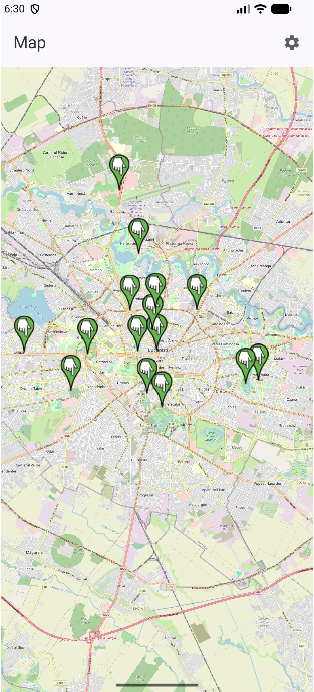
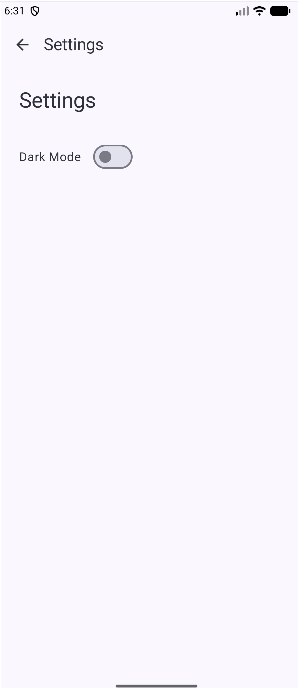

# Magnolia App - Description

App that shows a map with Magnolia locations in the city, allowing users to visit them.

# Magnolia App — Screens

Below are the main screens for the Magnolia app.

---

## Map Screen

_Main map view with Magnolia markers._

	

---

## Details Screen

_Details view for a selected Magnolia (image, coordinates, description)._

	

---

## Settings Screen

_Simple settings screen (toggles like Dark Mode)._ 

	

---

## Technologies Used

- Retrofit - used to access the local Magnolia API and load the magnolia data.
- Room Database - used to store the magnolias that the user has visited.
- osmdroid - map library used for the OpenStreetMap view.
- Coil - image loading for Magnolia photos.

